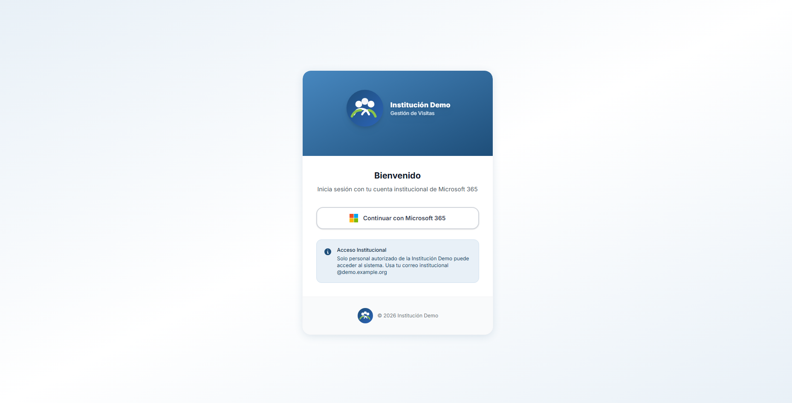
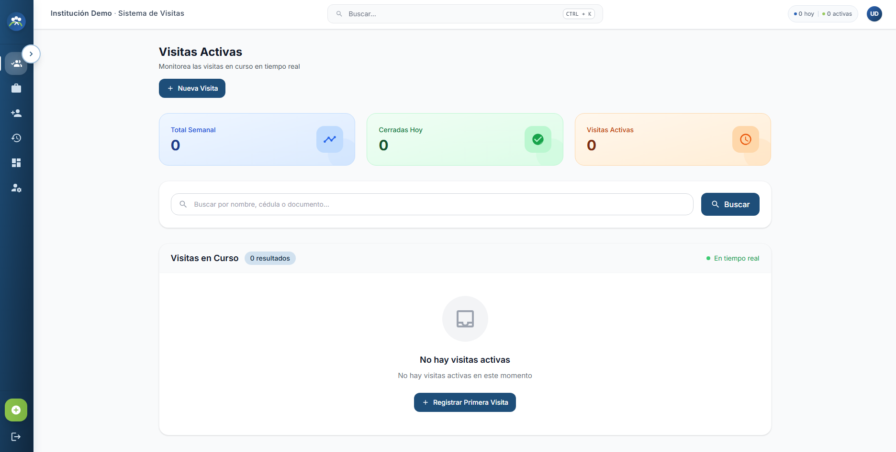
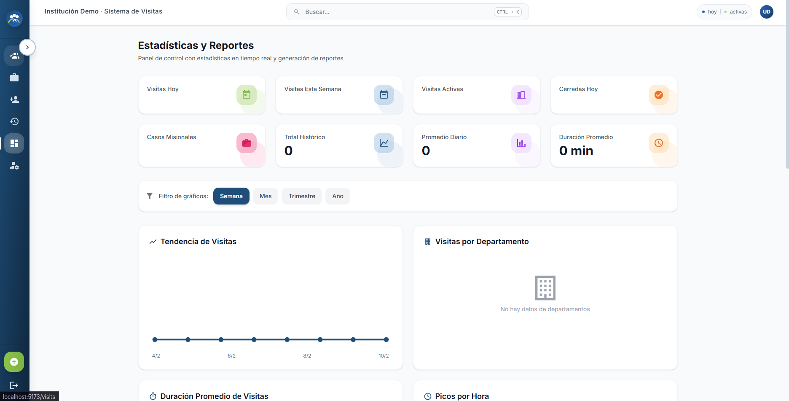
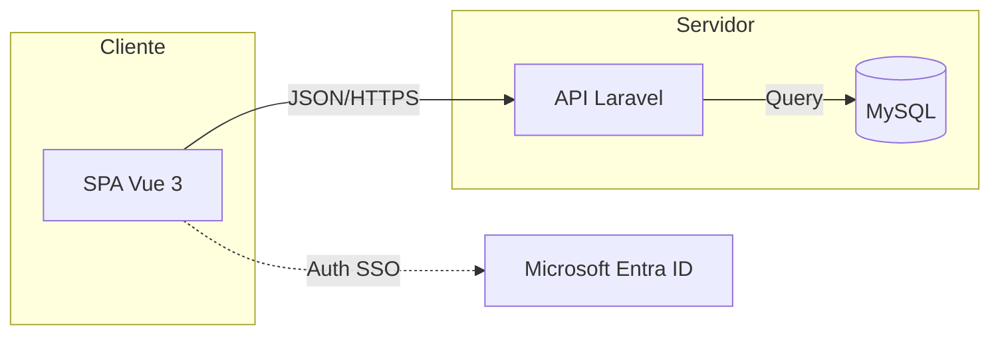


# Institución Demo – Gestión de Visitas

Proyecto de gestión integral del flujo de visitas (registro, seguimiento, cierres, reportes y alertas) con backend Laravel y frontend Vue.js. Esta aplicación fue desarrollada **en solitario** por mí durante una pasantía y está publicada aquí como parte de mi portafolio. Para proteger a la institución donde se creó, **la app fue anonimizada** y los datos se sustituyeron por ejemplos realistas.

---

##  Descripción del Proyecto

Este sistema fue diseñado para reemplazar el manejo de visitas mediante notas en papel, un método que generaba lentitud en la recepción, falta de controles de seguridad y nula trazabilidad de los datos.

La aplicación digitaliza todo el ciclo de acceso, permitiendo registros ágiles, validación de alertas en tiempo real y reportes automáticos. Esto transformó un proceso manual y vulnerable en un sistema eficiente, seguro y auditable.

---

##  Capturas de Pantalla

A continuación, se muestran algunas capturas de pantalla de la aplicación en funcionamiento.

### Pantalla de Inicio de Sesión (Login)
<div align="center">
  
</div>

---

### Tablero Principal (Dashboard)
<div align="center">
  
</div>

---

### Módulo de Estadísticas
<div align="center">
  
</div>

---

##  Funcionalidades principales

- Registro y control de visitas con estados y cierre de salida.
- Gestión de visitantes (datos de identificación, contacto y organización).
- Flujos especiales para **casos misionales**.
- Reportes (PDF/Excel) con filtros por rango de fechas, departamento y tipo.
- Notificaciones por correo con plantilla institucional.
- Panel de estadísticas (visitas activas, totales, promedios por día/semana).
- Módulo de alertas/denuncias integrado a un catálogo maestro.
- Gestión de usuarios y roles con permisos por perfil.

---

##  Roles y permisos (demo)

- **Administrador**: Acceso total, configuración y usuarios.
- **Asistente Administrativo**: Gestión general de visitas (no misionales).
- **Guardia**: Control de acceso, cierres y validaciones.
- **Auxiliar Unidad de Gestión**: Gestión de visitas misionales activas.

---

##  Stack tecnológico

**Backend**
- Laravel (API REST)
- PHP 8.x
- MySQL
- JWT
- Servicios de correo (configurable)

**Frontend**
- Vue 3 + Vite
- Tailwind CSS
- Axios
- Componentes UI personalizados

**DevOps / Infra (Azure – despliegue original)**
- Azure App Service (API Laravel)
- Azure Database for MySQL (datos de producción)
- Azure Static Web Apps (SPA Vue)
- Azure AD / Microsoft Entra ID (SSO)
- Pipelines CI/CD (retirados en esta versión por anonimización)

---

##  Arquitecturas usadas

**Arquitectura cliente-servidor (SPA + API)**



- El frontend es una SPA en Vue que consume endpoints HTTP.
- El backend Laravel expone la API, aplica reglas de negocio y autorización.
- Persistencia relacional en MySQL.

**Backend por capas (sobre MVC de Laravel)**

**Estilo de API**

- Predomina un estilo **API REST (pragmático)**:
	- Recursos y verbos HTTP (`GET/POST/PUT/PATCH/DELETE`).
	- Endpoints protegidos con JWT.
	- Segmentación por dominio (`/visits`, `/admin/users`, `/alertas`, `/catalogos`).

**Arquitectura frontend**

- **Arquitectura basada en componentes** (Vue 3).
- **Composables** para lógica reutilizable (estado y reglas de vista).
- **Capa de servicios API** (Axios centralizado con interceptores de auth/errores).
- **Route Guards** para control de acceso por autenticación y rol.

---

##  Autenticación con Microsoft (SSO)

Implementé el flujo de autenticación con **Microsoft Entra ID (Azure AD)** usando MSAL en el frontend:

1. El usuario inicia sesión con Microsoft 365.
2. MSAL obtiene un `access_token`.
3. El frontend envía el token a la API Laravel.
4. La API valida el token, registra/actualiza el usuario y emite JWT propio.
5. El frontend usa el JWT para proteger rutas y consumir endpoints internos.

Este flujo permite SSO corporativo y control de accesos por roles.

---

## ️ DevOps / Azure (mi aporte)

- Provisioné y configuré los servicios de Azure (App Service, DB, Static Web Apps).
- Configuré variables de entorno, dominios, CORS, y enlaces entre servicios.
- Implementé pipelines CI/CD para despliegue automatizado.
- **Nota**: en esta versión pública/anónima se retiraron los pipelines por seguridad.

---

## ️ Anonimización

Esta versión reemplaza:
- Nombres institucionales por **“Institución Demo”**.
- Dominios, correos y URLs reales por ejemplos.
- Credenciales reales y valores sensibles por placeholders.
- Logs y artefactos de build por seguridad.

La app conserva la estructura real para demostrar capacidades técnicas sin exponer datos.

---

## Cómo ejecutar localmente (demo)

### Requisitos
- PHP 8.1+
- Composer
- Node.js 18+
- npm 9+
- MySQL

### Pasos

```powershell
# 1) Instalar dependencias
npm run install:all

# 2) Backend
copy backend\.env.example backend\.env
cd backend
php artisan key:generate
php artisan jwt:secret
cd ..

# 3) Migraciones + seeders (datos demo)
npm run migrate
npm run migrate:fresh

# 4) Ejecutar
npm run dev
```

---

## ️ Autoría

Proyecto desarrollado **100% por mí**: análisis, diseño, desarrollo, UI, integración con Microsoft y despliegue en Azure.

---

##  Licencia

Uso académico y de portafolio. No contiene datos reales de la institución original.